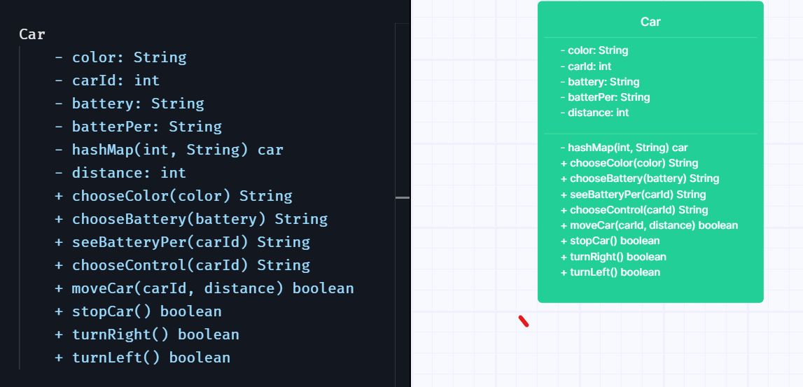

# Exercise 1

```
I have a remote controlled car:

I want to be able to decide on the colour of the car.

I want to be able to choose between rechargable and disposable batteries.

I want to choose between a simple and an advanced remote control.

I want to be able to see the battery percentage remaining.

I want to be able to move the car forward and backward a specific distance.

I want to be able to stop the car from moving.

I want to be able to turn the car left and right.

I want to be able to replace the battery with either kind as needed.
```
## Car Class

1.
| Methods                   | Member variables | Scenario         | Outputs/Results/Return values |
|---------------------------|------------------|------------------|-------------------------------|
| chooseColor(String color) | String color     | if color add     | True                          |
|                           |                  | if color not add | false                         |
|                           |                  |                  |

2.
| Methods                       | Member variables | Scenario           | Outputs/Results/Return values |
|-------------------------------|------------------|--------------------|-------------------------------|
| chooseBattery(String battery) | String battery   | if battery add     | True                          |
|                               |                  | if battery not add | false                         |
|                               |                  |                    |

3.
| Methods                         | Member variables          | Scenario                               | Outputs/Results/Return values |
|---------------------------------|---------------------------|----------------------------------------|-------------------------------|
| seeBatteryPercentage(int carID) | HashMap(int, String) cars | if battery percentage is diplayed      | True                          |
|                                 |                           | if bettery percentage is not displayed | false                         |
|                                 |                           |                                        |
4.
| Methods                  | Member variables          | Scenario            | Outputs/Results/Return values |
|--------------------------|---------------------------|---------------------|-------------------------------|
| chooseControl(int carId) | hashMap(int, String) cars | if show control     | True                          |
|                          |                           | if not show control | false                         |
|                          |                           |                     |

5.
| Methods                          | Member variables          | Scenario        | Outputs/Results/Return values |
|----------------------------------|---------------------------|-----------------|-------------------------------|
| moveCar(int carId, int distance) | hashMap(int, String) cars | if car move     | True                          |
|                                  | int distance              | if car not move | false                         |
|                                  |                           |                 |

6.
| Methods                          | Member variables          | Scenario          | Outputs/Results/Return values |
|----------------------------------|---------------------------|-------------------|-------------------------------|
| moveCar(int carId, int distance) | hashMap(int, String) cars | if car moving     | stopCar() "car Stopped"       |
| stopCar()                        | int distance              | if car not moving | "car is stopped"              |
|                                  |                           |                   |

6.
| Methods              | Member variables          | Scenario        | Outputs/Results/Return values |
|----------------------|---------------------------|-----------------|-------------------------------|
| turnRight(int carId) | hashMap(int, String) cars | if car turn     | True                          |
| turnLeft(int carId)  |                           | if car not turn | False                         |
|                      |                           |                 |


7.
| Methods                       | Member variables | Scenario           | Outputs/Results/Return values |
|-------------------------------|------------------|--------------------|-------------------------------|
| chooseBattery(String battery) | String battery   | if battery add     | True                          |
|                               |                  | if battery not add | false                         |
|                               |                  |                    |


