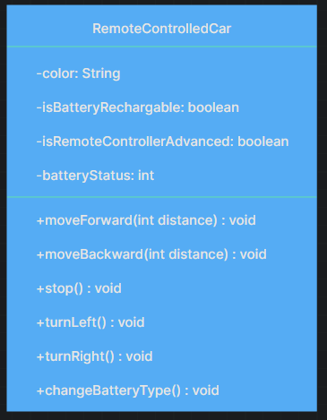

# Class diagram

```
RemoteControlledCar
    -color: String
    -isBatteryRechargable: boolean
    -isRemoteControllerAdvanced: boolean
    -batteryStatus: int
    
    +moveForward(int distance)
    +moveBackward(int distance)
    +stop()
    +turnLeft()
    +turnRight()
    +changeBatteryType()
```

